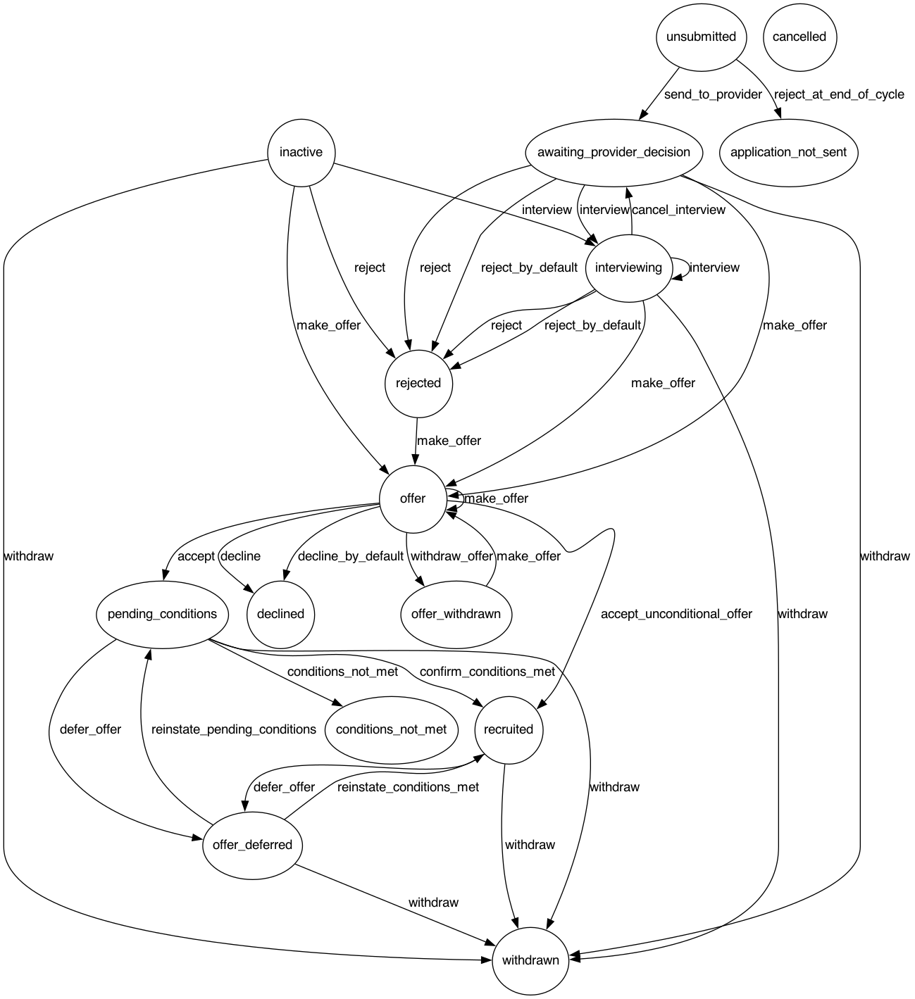

**BUILD:**     [](https://dfe-ssp.visualstudio.com/Become-A-Teacher/_build/latest?definitionId=49&branchName=master)

**DEPLOY:** [](https://dfe-ssp.visualstudio.com/Become-A-Teacher/_build/latest?definitionId=325&branchName=master)

# Apply for teacher training

A service for candidates to apply for initial teacher training.

## Environments

| Name | URL | Description |
| -- | -- | -- |
| Production | [www.apply-for-teacher-training.education.gov.uk](https://www.apply-for-teacher-training.education.gov.uk/candidate) | Public site |
| Staging | [staging.apply-for-teacher-training.education.gov.uk](https://staging.apply-for-teacher-training.education.gov.uk) | For internal use by DfE to test deploys |
| Sandbox | [sandbox.apply-for-teacher-training.education.gov.uk](https://sandbox.apply-for-teacher-training.education.gov.uk) | Demo environment for software vendors who integrate with our API |
| QA | [qa.apply-for-teacher-training.education.gov.uk](https://qa.apply-for-teacher-training.education.gov.uk) | For internal use by DfE for testing. Automatically deployed from master |

When setting up a new environment, check you have followed [the instructions
for doing so](#deploy-env-setup).

## Table of Contents

* [Dependencies](#dependencies)
* [Prerequisites for development](#dev-prerequisites)
* [Setting up the development environment](#dev-env-setup)
* [Setting up new deployment environments](#deploy-env-setup)
* [Docker workflow](#docker-workflow)
* [Releases](#releases)
* [DfE Sign-in](#dfe-sign-in)
* [Webpacker](#webpacker)
  * [Debugging Webpacker](#webpacker-debug)
* [Documentation](#documentation)
  * [Nomenclature](#documentation-nomenclature)
  * [Domain Model](#documentation-domain-model)
  * [Application States](#documentation-application-states)
  * [Environment Variables](#documentation-env-vars)
  * [Pipeline Variables](#documentation-pipeline-vars)
  * [Database Restore](#documentation-db-restore)
  * [Connecting to live databases](#documentation-db-connect)
  * [Testing](#testing)

## <a name="dependencies"></a>Dependencies

- Ruby 2.6.3
- NodeJS 8.11.x
- Yarn 1.12.x
- PostgreSQL 9.6
- Graphviz 2.22+ (`brew install graphviz`) to generate the [domain model diagram](#domain-model)
- Redis 5.0.x

## <a name="dev-prerequisites"></a>Prerequisites for development

`docker` and `docker-compose`

## <a name="dev-env-setup"></a>Setting up the development environment

1. Copy `.env.example` to `.env` and fill in the secrets
1. Run `make setup`
1. Run `make serve` to launch the app on https://localhost:3000

See `Makefile` for the steps involved in building and running the app.

The course and training provider data in the `Apply` service comes from its
sister service `Find`. To populate your local database with course data from
`Find`, run `bundle exec rake setup_local_dev_data`. This task also
creates a support user with DfE Sign-in UID `dev-support` that you can
use to log into the Support interface in your development environment.

### Background processing

Certain features depend on Sidekiq running. e.g. Mailers and some of the
business rules that set time-dependent state on applications. In order
to run a local version of you need to make sure Redis is installed and
running and then run Sidekiq. The simplest way to do that is with
`docker-compose` (see below) or `foreman`. e.g.

    $ foreman start


## <a name="deploy-env-setup"></a>Setting up new deployment environments

New deployment environments are configured by Azure specialists via the Azure YAML and JSON files.

Once a fresh environment is deployed, it is necessary to enable feature flags
and perhaps grant access to support and provider users.

To do this it's necessary to have a Support user set up, but support users are
created via the support UI, which is only accessible to Support users!

It is possible to grant access directly by updating the database of the environment
in question.

1. Connect to the database following the [instructions for connecting to a production database]('/docs/connecting-to-databases.md')
2. Issue the following query, which writes your email address (EMAIL) and DfE Sign-in uid (UID) into the support_users table.

```
INSERT INTO support_users (email_address, dfe_sign_in_uid, created_at, updated_at) VALUES ('EMAIL', 'UID', current_timestamp, current_timestamp);
```

## <a name="docker-workflow"></a>Docker Workflow

Under `docker-compose`, the database uses a Docker volume to persist
storage across `docker-compose up`s and `docker-compose down`s. For
want of cross-platform compatibility between JavaScript libraries, the
app's `node_modules` folder is also stored in a persistent Docker
volume.

Running `make setup` will blow away and recreate those volumes,
destroying any data you have created in development. It is necessary
to run it at least once before the app will boot in Docker.

## <a name="releases"></a>Releases

The apply build and release process is split into two separate Azure DevOps pipelines.
- [apply-for-postgraduate-teacher-training](https://dfe-ssp.visualstudio.com/Become-A-Teacher/_build?definitionId=49&_a=summary): This is the main development CI pipeline which will automatically trigger a build from a commit to any branch within the Apply GitHub code repository. When commits are made to the master branch, this pipeline will also deploy the application to the QA infrastructure environment in Azure automatically.
- [apply-for-postgraduate-teacher-training-releases](https://dfe-ssp.visualstudio.com/Become-A-Teacher/_build?definitionId=325&_a=summary): This is the main release pipeline that is used to deploy to all other Azure environments except QA. Releases are triggered manually and the target environments can be chosen prior to deployment.

### <a name="releases-triggering"></a>Deploying

👉 [See the deployment guide](/docs/deployment.md)

## <a name="dummy-data"></a>Dummy data

We have a service `GenerateTestData` which generates `ApplicationChoice`s in
the database. You can specify how many `ApplicationChoice`s are created and to
which provider they are applying.

If you don't specify a provider, the `ApplicationChoice`s will be for courses
at provider code `ABC`.

**Generate 10 applications for the default provider (ABC)**

```
GenerateTestData.new(10).generate
```

**Generate 10 applications for a specific provider**

```
GenerateTestData.new(10, Provider.find_by(code: '1N1')).generate
```

## <a name="dfe-sign-in"></a>DfE Sign-in

The Provider interface at `/provider` and Support interface at
`/support` are both protected by DfE's SSO provider DfE Sign-in.

### Environments

In development, QA, and pentest we use the **Test** environment of DfE Signin:

[Manage console (test)](https://signin-test-mng-as.azurewebsites.net/)

```sh
# .env
DFE_SIGN_IN_ISSUER=https://signin-test-oidc-as.azurewebsites.net
```

In staging, production and sandbox we use the **Production** environment of DfE Signin:

[Manage console (production)](https://manage.signin.education.gov.uk)

```sh
# .env
DFE_SIGN_IN_ISSUER=https://oidc.signin.education.gov.uk
```

### Local development

Logging in to the Provider interface requires a network connection and a user
account on DfE Sign-in. In development you can eliminate this dependency by
setting `BYPASS_DFE_SIGN_IN=true` in your `.env` file. This replaces the login
flow with a dialog allowing you to specify a DfE Sign-in UID and Email address
for your current session.

### Heroku

When a new PR is opened, a review app is deployed via Heroku. This has a `HOSTING_ENVIRONMENT=development`, an empty database which gets seeded with local dev data, and a URL which is similar to `https://apply-for-teacher-training.herokuapp.com`. The Heroku configuration is in [`app.json`](app.json).

### Provider permissions

We decide what to show providers based on their DfE Sign-in UID.

To grant a user permission to view a provider’s applications, visit
/support/users/providers and create a user, specifying their DfE Sign-in UID
and the relevant provider.

### Support permissions

There is a `support_users` database table that lists all the DfE Sign-in
accounts that have access to the Support interface based on their DfE
Sign-in UID. There is only one privilege level, either you have access
to everything or nothing.

You can add a new support user using the `create_support_user` rake
task. You need to supply a DfE Sign-in UID and an email address, e.g.

    $ bundle exec rails "create_support_user[alice, alice@example.com]"

Note that only the UID is used for lookup. The email address serves only
as a label.

## <a name="webpacker"></a>Webpacker

We do not use the Rails asset pipeline. We use the Rails webpack wrapper
[Webpacker](https://github.com/rails/webpacker) to compile our CSS, images, fonts
and JavaScript.

### <a name="webpacker-debug"></a>Debugging Webpacker

Webpacker sometimes doesn't give clear indications of what's wrong when it
doesn't work.

**If you see repeated 'Webpacker compiling...' messages in the Rails server
log**, a good place to start debugging is by running the webpack compiler via
`bin/webpack`. This will give a much faster feedback loop than making requests
using a web browser.

**If you get `Webpacker::Manifest::MissingEntryError`s**, this usually points
to a problem in the compilation process which is causing one or more files not
to be created. Make sure that your yarn packages are up to date using `yarn
check` before proceeding to debug using `bin/webpack`.

**If assets work in dev but not in tests**, first confirm that you can compile
by invoking `bin/webpack`. If all is well, there is a chance that
`public/packs-test` contains stale output. Delete it and re-run the suite.

## <a name="documentation"></a>Documentation

### <a name="documentation-nomenclature"></a>Nomenclature
- **Course** consists of a UCAS provider code and a UCAS course code. In our system, this is represented by the `provider_code` and `course_code` on the `ApplicationChoice` model
- **Course Choice** is the course plus a training location code, in our system represented by `provider_code`, `course_code`, `location_code`

### <a name="documentation-domain-model"></a>Domain Model


Regenerate this diagram with `bundle exec erd`.

### <a name="documentation-application-states"></a>Application states



Regenerate this diagram with `bundle exec rake generate_state_diagram`.

### <a name="documentation-env-vars"></a>Environment Variables

**NOTE: Environment variables should not start with *endpoint*, *input*, *secret*, or *securefile* (irrespective of capitalisation) due to them being protected variable names within the Azure DevOps environment.** If this cannot be avoided variable mapping will have to be used, but wherever possible it is simpler not to use these protected names.

Environment variables have to be defined in several places depending upon where they are required, some are common to both local development and the Azure hosted deployment, while others are specific to the environments they relate, all of which are described below

#### <a name="documentation-env-vars-dockerfile"></a>Dockerfile

If an environment variable is required during the Docker image build, like for example in the Rails asset compilation process, these should be defined in the Dockerfile in the following format.

`ENV VARIABLE_NAME=Value`

When defining variables in the Dockerfile use dummy values for security reasons since they will be committed to Git and they will ultimately be overriden by docker-compose when you launch a container using the image.

#### <a name="documentation-env-vars-local-dev"></a>Local Development

If an environment variable is required for use in the local development environment it should be declared in the .env file in the following format

`VARIABLE_NAME=Value`

The [.env.example](./.env.example) file contains the essential environment variables that must exist for local development builds to succeed.

#### <a name="documentation-env-vars-docker-compose"></a>Docker Compose

For docker compose to make the necessary environment variables available in the container at run time they must be declared in the relevant docker-compose.yaml file, of which there are three.

* [docker-compose.yml](./docker-compose.yml) - Variables that are required for local dev and the docker image build phase in azure only should be defined the *environment* section in this file. This will in general only be for the database.
* [docker-compose.override.yml](./docker-compose.override.yml) - This file is used exclusively for local development. No further changes are required here.
* [docker-compose.azure.yml](./docker-compose.azure.yml) - This file is exclusively used in the Azure devops pipeline. Any environment variables required in the Azure build/deployment need to be declared in the *environment* section of this file. **You should only declare the environment variable here, not its value.** The only exception to this is where we need to map variables due to the use of protected variable names, e.g. Rails SECRET_KEY_BASE.

#### <a name="documentation-env-vars-azure-devops"></a>Azure Hosting (DevOps pipeline)

These steps describe the process for making environment variables available to the the Azure DevOps pipeline.

1. Declare the desired variable in the appropriate "variable group" in the Library section of the Azure DevOps site (https://dfe-ssp.visualstudio.com/Become-A-Teacher/_library?itemType=VariableGroups). All variable groups related to apply are suffixed as such and there is a variable group per deployment environment.
1. In the [azure-pipelines.yml](./azure-pipelines.yml) and [azure-pipelines-release.yml](./azure-pipelines-release.yml) file there are several changes to be made:
   1. (Applies to [azure-pipelines.yml](./azure-pipelines.yml) only) For each "make" command script step, add your environment variable to the *env* section in the format `ENV_VAR_NAME: $(varName)` where **ENV_VAR_NAME** is the environment variable name as it should appear in the docker container and **varName** is the name of the variable defined in the Azure DevOps variable group.
   1. For each 'deployment stage' you must add your variable to the template *parameters* section in the format `varName: '$(varName)'`.
1. In the [azure-pipelines-deploy-template.yaml](./azure-pipelines-deploy-template.yml) file you need to make the following additions:
   1. Add your variable to the *parameters* section at the start of the file using the name of the variable as it appears in the variable group.
   1. In the Azure Resource Group deployment task *overrideParameters* section add your variable in the format `-varName: "${{parameters.varName}}"`
1. In the [azure/template.json](./azure/template.json) file you need to make the following additions:
   1. Duplicate this block of code for your new variable in the *parameters* section at the start of the file.
      ```
      "varName": {
        "type": "string",
        "metadata": {
          "description": "Describe your variable here."
        }
      }
      ```
   1. Around line 505 duplicate this block of code in the *appEnvironmentVariables* parameter of the `app-service-and-containers` resource and configure it to match your new environment varaible. If the environment variable in question contains a secret, change `value` to `secureValue`.
      ```
      {
        "name": "ENV_VAR_NAME",
        "value": "[parameters('varName')]"
      }
      ```

### <a name="documentation-pipeline-vars"></a>Pipeline Variables

#### <a name="documentation-pipeline-vars-availability"></a>Availability Monitoring

By default the `/check` path of the azurewebsites.net URL is automatically monitored in each environment, as is the same path on the education.gov.uk domain, if configured. To add extra URLs for monitoring ensure the following format is used in the `customAvailabilityMonitors` pipeline variable for each URL you wish to monitor.

`["TEST-NAME1:DOMAIN1","TEST-NAME2:DOMAIN2"]`

The `TEST-NAMEn` should be short, unique and descriptive and contain no spaces. The `DOMAINn` should be the complete domain without the protocol specified (i.e drop the "http(s)://").

To enable email alerting for the custom URLs you must update the `alertRecipientEmails` pipeline variable for each environment as required in the following format.

`["NAME1:EMAIL1","NAME2:EMAIL2"]`

`NAMEn` is the display name for the email recipient. At the present time this name cannot contain any spaces. `EMAILn` is the email address of the recipient.

Email alerting is not configured for the `/check` domains using this approach, it only applies to any custom URLs added in the pipeline variables. If no email alerting is required, the `alertRecipientEmails` pipeline variable should be left empty or not set.

### <a name="documentation-db-restore"></a>Database Restore

👉 [See the database restore guide](/docs/database-restore.md)

### <a name="documentation-db-connect"></a>Connecting to live databases

👉 [See instructions for connection to production database](/docs/connecting-to-databases.md)

### <a name="testing"></a>Testing

👉 [See testing styleguide](/docs/testing-styleguide.md)
