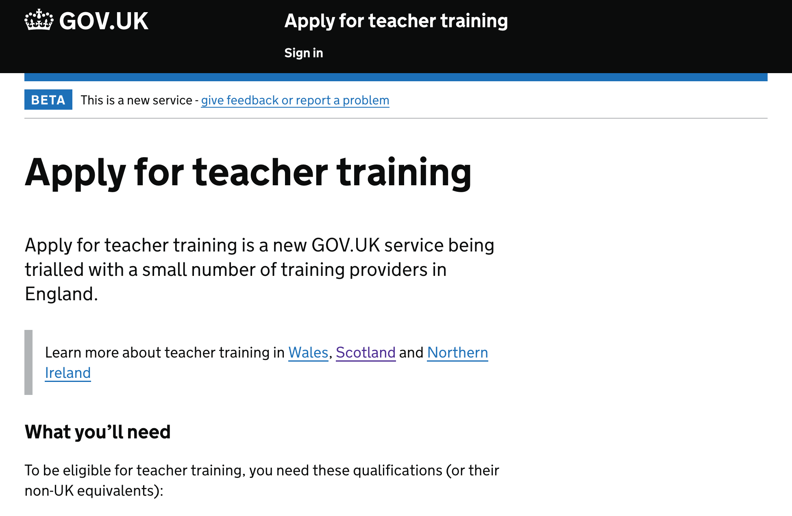
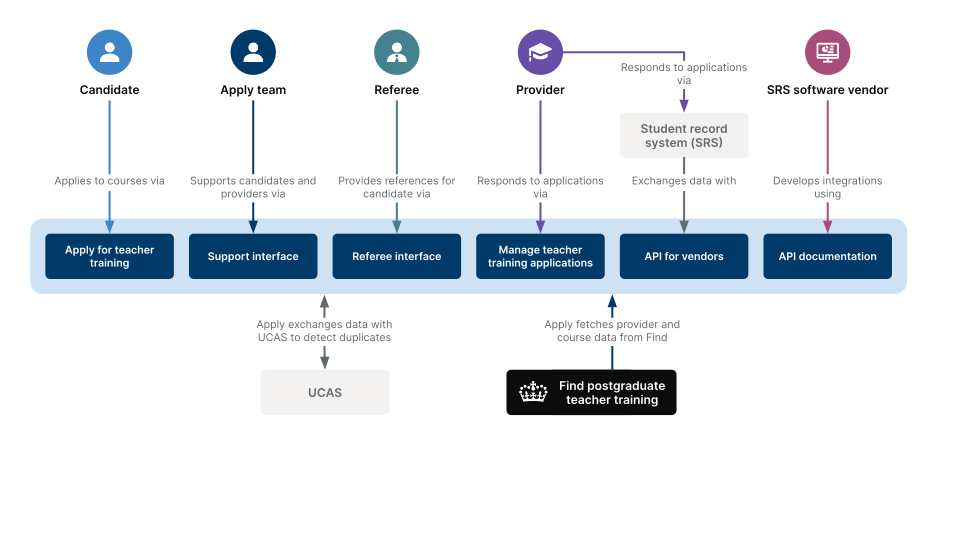
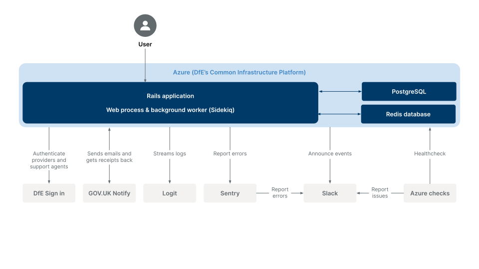

[](https://www.skylight.io/app/applications/t8bEzG0cuIkd)

# Apply for teacher training

A service for candidates to [apply for teacher training](https://www.apply-for-teacher-training.service.gov.uk/candidate). We're currently in private beta.



## Live environments

| Name       | URL                                                                  | Description                                                             | Azure ID  |
| ---------- | -------------------------------------------------------------------- | ----------------------------------------------------------------------- | --------- |
| Production | [www](https://www.apply-for-teacher-training.service.gov.uk)         | Public site                                                             | `s106p01` |
| Staging    | [staging](https://staging.apply-for-teacher-training.service.gov.uk) | For internal use by DfE to test deploys                                 | `s106t01` |
| Sandbox    | [sandbox](https://sandbox.apply-for-teacher-training.service.gov.uk) | Demo environment for software vendors who integrate with our API        | `s106t02` |
| QA         | [qa](https://qa.apply-for-teacher-training.service.gov.uk)           | For internal use by DfE for testing. Automatically deployed from master | `s106d01` |
| DevOps     | [dev](https://dev.apply-for-teacher-training.service.gov.uk)         | For testing infrastructure changes                                      | `s106d02` |

## Table of Contents

- [Documentation](#documentation)
- [Dependencies](#dependencies)
- [Development environment](#development-environment)
- [DfE Sign-in](#dfe-sign-in)

## Guides

- [Developer on-boarding](/docs/developer-onboarding.md)
- [Connect to a production database](/docs/connecting-to-databases.md)
- [Deploy the application](/docs/deployment.md)
- [Environment variables](/docs/environment-variables.md)
- [Frontend development](/docs/frontend.md)
- [Pipeline Variables](/docs/pipeline-variables.md)
- [Restore a database](/docs/database-restore.md)
- [Set up a new environment](/docs/new-environment.md)
- [Testing style guide](/docs/testing-styleguide.md)
- [Rails components](/docs/components.md)
- [Docker for DevOps](/docs/docker-for-devops.md)
- [Swapping App Service Slots](/docs/swap-slots-pipeline.md)
- [Performance monitoring](/docs/performance-monitoring.md)

We keep track of the things we learn:

- [Lessons learned](/docs/lessons-learned.md)

## How the application works

The application has a number of different interfaces for different types of users:



<!-- Want to update the diagram? See https://docs.google.com/presentation/d/1_VEUY0RXZpUrS3YuAoS6KcZs9h5hKOSjLnQistz5jp8/edit#slide=id.g8791ae7f92_0_359 -->

### Architecture



<!-- Want to update the diagram? See https://docs.google.com/presentation/d/1_VEUY0RXZpUrS3YuAoS6KcZs9h5hKOSjLnQistz5jp8/edit#slide=id.g8791ae7f92_0_359 -->

We keep track of architecture decisions in [Architecture Decision Records (ADRs)](/adr).

An overview of the Azure hosted infrastructure architecture can be found in the [Azure Infrastructure](/docs/azure-infrastructure.md) document.

### Domain Model


For simplicity the auditing table is not displayed in the diagram, as it is connected to most tables in the database.

Regenerate this diagram with `bundle exec rake erd`.

### Application states


Regenerate this diagram with `bundle exec rake generate_state_diagram`.

## Dependencies

### Production dependencies

- [Ruby](.ruby-version)
- Node.js – see [package.json](package.json) for version
- Yarn – see [package.json](package.json) for version
- PostgreSQL 9.6
- Redis 5.0.x

### Development dependencies

There are two ways to run the application in development. Running a local development environment is the most common approach but it is also possible to run in local Docker containers.

## Development environment

### Running the application with local dependencies

The most common way to run a development version of the application is run with local dependencies.

#### Local development dependencies

- `postgresql`
- `redis`
- Graphviz 2.22+ (`brew install graphviz`) to generate the [domain model diagram](#domain-model)
- [`ruby`](.ruby-version)
- `bundle 2.1.4+`

You'll also need to copy `.env.example` to `.env` and fill in the secrets.
This will populate required environment variables

Once those dependencies are installed, run `bundle install` to install required gems.

#### Local db setup

1. Start the postgres service: `sudo service postgresql start` on Linux or `brew services start postgresql` on Mac
1. Populate the `DB_` relevant environment variables with the correct values (those are: `DB_USERNAME`, `DB_PASSWORD`, `DB_HOSTNAME` and `DB_PORT`)
1. Then local development databases and data can be set up: `bundle exec rake db:setup`
(You may wish to [set up development data](#development-data) at this point)

#### Running the app

To run the application locally:

1. Run `yarn` to install dependencies for the web app to run
2. Run `foreman start` to launch the app on http://localhost:3000

### Running the application in Docker

As an alternative to that, it's also possible to run the application in Docker:

#### Docker dependencies

- `docker`
- `docker-compose`
- Graphviz 2.22+ (`brew install graphviz`) to generate the [domain model diagram](#domain-model)

#### Running the app

Install the above dependencies, and then:

1. Copy `.env.example` to `.env` and fill in the secrets
1. Run `make setup`
1. Run `make serve` to launch the app on https://localhost:3000

See `Makefile` for the steps involved in building and running the app.

### Development data

The course and training provider data in the Apply service comes from its
sister service `Publish`. To populate your local database with course data from
`Publish`, first start the redis service (`redis-server`) and then run `bundle exec rake setup_local_dev_data`.

Among other things, this task also creates a support user with DfE Sign-in UID
`dev-support` that you can use to sign in to the Support interface in your
development environment, and a provider user with the UID `dev-provider`.

### Background processing

Certain features depend on Sidekiq running. e.g. Mailers and some of the
business rules that set time-dependent state on applications. In order
to run a local version of Sidekiq you need to make sure Redis is installed and
running and then run Sidekiq. The simplest way to do that is with
`docker-compose` (see below) or `foreman`. e.g.

    $ foreman start

### Docker Workflow

Under `docker-compose`, the database uses a Docker volume to persist
storage across `docker-compose up`s and `docker-compose down`s. For
want of cross-platform compatibility between JavaScript libraries, the
app's `node_modules` folder is also stored in a persistent Docker
volume.

Running `make setup` will blow away and recreate those volumes,
destroying any data you have created in development. It is necessary
to run it at least once before the app will boot in Docker.

## DfE Sign-in

The Provider interface at `/provider` and Support interface at
`/support` are both protected by DfE's SSO provider DfE Sign-in.

### Environments

In development and QA we use the **Test** environment of DfE Sign-in:

[Manage console (test)](https://test-manage.signin.education.gov.uk)

```sh
# .env
DFE_SIGN_IN_ISSUER=https://test-oidc.signin.education.gov.uk
```

In staging, production and sandbox we use the **Production** environment of DfE Sign-in:

[Manage console (production)](https://manage.signin.education.gov.uk)

```sh
# .env
DFE_SIGN_IN_ISSUER=https://oidc.signin.education.gov.uk
```

### Local development

Logging in to the Provider interface requires a network connection and a user
account on DfE Sign-in. In development you can eliminate this dependency by
setting `BYPASS_DFE_SIGN_IN=true` in your `.env` file. This replaces the login
flow with a dialog allowing you to specify a DfE Sign-in UID and Email address
for your current session.

### Provider permissions

We decide what to show providers based on their DfE Sign-in UID.

To grant a user permission to view a provider’s applications, visit
/support/users/providers and create a user, specifying their DfE Sign-in UID
and the relevant provider.

### Support permissions

There is a `support_users` database table that lists all the DfE Sign-in
accounts that have access to the Support interface based on their DfE
Sign-in UID. There is only one privilege level, either you have access
to everything or nothing.

You can add a new support user using the `create_support_user` rake
task. You need to supply a DfE Sign-in UID and an email address, e.g.

    $ bundle exec rails "create_support_user[alice, alice@example.com]"

Note that only the UID is used for lookup. The email address serves only
as a label.

## Heroku review apps

When a new PR is opened, a review app is deployed via Heroku. This has a `HOSTING_ENVIRONMENT=development`, an empty database which gets seeded with local dev data, and a URL which is similar to `https://apply-for-teacher-training.herokuapp.com`. The Heroku configuration is in [`app.json`](app.json).

## License

[MIT Licence](LICENCE)
