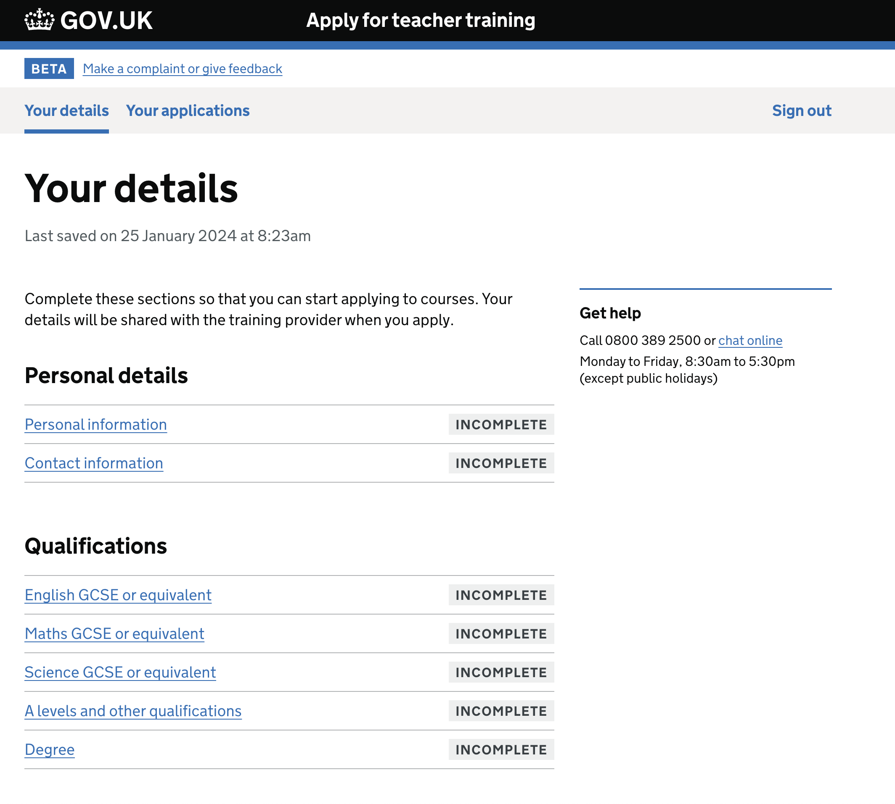

# Apply for teacher training

A service for candidates to [apply for teacher training](https://www.apply-for-teacher-training.service.gov.uk/candidate).

## Live environments

| Name       | URL                                                                  | Description                                                           | AKS namespace    |
| ---------- | -------------------------------------------------------------------- | --------------------------------------------------------------------- | ---------------- |
| Production | [www](https://www.apply-for-teacher-training.service.gov.uk)         | Public site                                                           | `bat-production` |
| Sandbox    | [sandbox](https://sandbox.apply-for-teacher-training.service.gov.uk) | Demo environment for software vendors who integrate with our API      | `bat-production` |
| Staging    | [staging](https://staging.apply-for-teacher-training.service.gov.uk) | For internal use by DfE to test deploys                               | `bat-staging`    |
| QA         | [qa](https://qa.apply-for-teacher-training.service.gov.uk)           | For internal use by DfE for testing. Automatically deployed from main | `bat-qa`         |

## Table of Contents

- [Dependencies](#dependencies)
- [Overview](#how-the-application-works)
- [License](#licence)

## Guides

- [General](docs/)
- [Development](docs/development/)
- [Infra](docs/infra/)

## Dependencies

### Production dependencies

| Dependency            | Version |
| ---                   |---------|
| [Ruby](.ruby-version) | 3.3.7   |
| Node.js               | 20.11.0 |
| Yarn                  | 1.22.19 |
| PostgreSQL            | 14      |
| Redis                 | 6.0.x   |

### Development dependencies

See [Developer setup](docs/development/developer-setup.md)

## How the application works

The application has a number of different interfaces for different types of users:

### Architecture

We keep track of architecture decisions in [Architecture Decision Records (ADRs)](/adr).

### Domain Model

For simplicity the auditing table is not displayed in the diagram, as it is connected to most tables in the database.

Regenerate this diagram with `bundle exec rake erd`.

### Application states

[See detailed documentation here](docs/states.md)

### Apply APIs

This app provides several APIs for programmatic access to the Apply service. [Read about them here](/docs/development/apply-apis.md).

## License

[MIT Licence](LICENCE)
