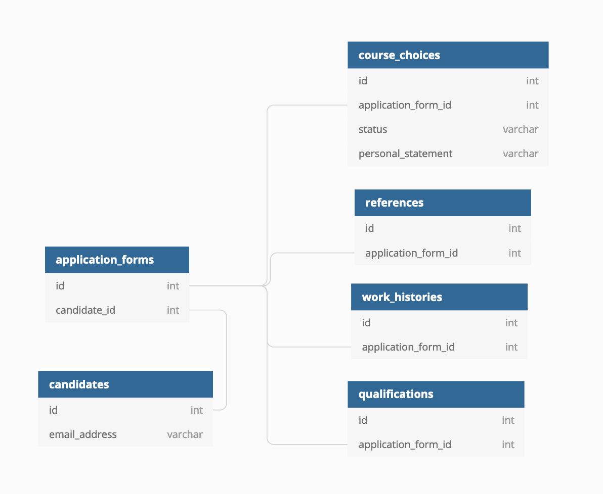

# 3. Initial data model

Date: 2019-09-24

## Status

Accepted

## Context

In the coming months we will be building this application. The first order of business is to come up with a sensible data model and application structure.

## Decision

We discussed a database model that is based around a small number of tables with a lot of columns. In particular:

- `Candidate`, primarily used for authentication
- `ApplicationForm`, which belongs to a Candidate, and holds the
information that is common to all of the applications that the user
makes (in the "Apply 1" phase, they can apply for up to three courses).
- `ApplicationChoice`, which holds the information that is course specific,
like the status of the application and the personal statement. It holds a reference to the "course choice", which is the combination of course, provider and the training location. 

There will be some other models that hold references, work histories and qualifications.

The eventual table structure will look something like this:

## Consequences

We will adopt the data model described.
