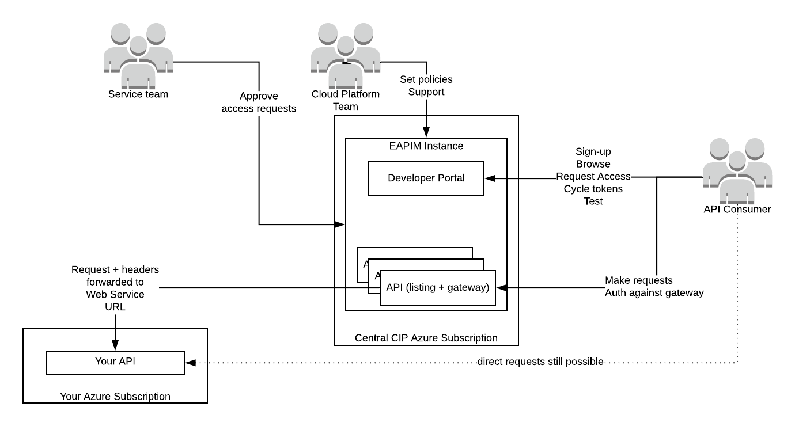

# 7. Integration with the Enterprise API Management Gateway

Date: 2019-10-31

## Status

Accepted

## Context

As part of our approval from the Architecture Review Board on 2019-10-16, we were heavily steered towards adopting the [Tech Group's implementation](https://dev-developers-customerengagement.platform.education.gov.uk) of [Azure's Enterprise API Management](https://azure.microsoft.com/en-gb/services/api-management) gateway service.

The model is as described in the following diagram:

The position as outlined by Jemma Sheargold is: "the API Gateway pattern must be applied, EAPIM is the way to this in the first instance", and we agreed in ARB to experiment with it.

We have experimented, and set up our dev API with the dev EAPIM instance.

### Findings

#### Pros

- for DFE: having all externally-facing APIs listed in one place
- for DFE: having a central place to allow/disallow access to all APIs + users, set policies, etc
- for the service: having rate-limiting etc be Someone Else's Problem

#### Cons

- for the User: the portal looks immature, with a confusing user experience and terminology
- for the User: they would now have two tokens to manage in two different places - one for the EAPIM gateway, and another one to authenticate against our backend
- for the Service Team: it adds another "thing" in between us and our users that we do not have any control over  
- for the Service Team: it is not clear how we would get notifications of requests for access via the dev portal, or if the model is that the CIP team would approve/deny them, then how would they know who is a valid user or not?
- for the User: there is a risk that future centrally-imposed changes could be incompatible with our vendor's integrations (e.g. central security policies, or Azure dropping support for some things) which, given the long lead times for changes to vendor systems (up to 2yrs in some cases) could effectively take our API offline for some clients.
- for the Service Team: the only way to add customised messages to the portal (for instance, how to get a token for the backend) is to add it into the OpenApi spec - but our tech docs are also auto-generated from the OpenApi spec, so we would have confusing messages on one or the other, or both.
- for the Service Team: it adds more overhead to managing access (two places to manage tokens rather than one)

## Decision

We will not be pursuing integration with EAPIM at this time. It adds too much overhead for too little benefit, and gives our users a worse experience than they already have.

We do not object to listing our API in the portal - but we will be directing our users towards our own existing token management & documentation, and not actively pointing our users towards the portal or gateway.

## Consequences

- This decision is a challenge to central Tech Group policy, so we should expect it to trigger some discussion and counter-challenge. We may have to justify it in further governance gateways.
