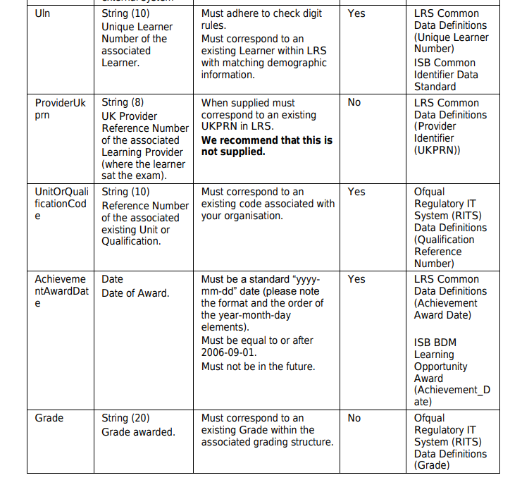

# 10. Structured data for freetext fields in API responses

Date: 2019-12-16

## Status

Proposal

## Context

Vendors have suggested that it'd be helpful for Apply to supply reference data (similarly to UCAS). To achieve this we need to:

- identify which fields could/should be structured
- identify canonical sources of data for these fields
- add agreed fields to the API responses, and
- provide dummy data in API docs/responses 

The structured reference data that UCAS currently makes available as codes is broadly:

- Course Information (pulled from FIND via the Publish API)
- Institutions
- Degree Subjects
- Qualification types
- Awarding Bodies Reference Codes (e.g. HESA codes related to diversity & demographic info)
- Disabilities
- Academic Years
- Nationalities

Initial feedback from vendors suggests they would specifically like consistency around qualification types, awarding bodies and academic years. A nice to have might be to include institutions.

There will always be cases when codes are not available for certain values. For instance, it may be impossible to obtain reliable lookup data for international qualifications. Therefore, any changes to our API responses should preserve the free-text versions of such fields.

### Findings

The Office of Qualifications and Examinations Regulation (Ofqual) is a non-ministerial government department that regulates qualifications, exams and tests in England. It maintains a downloadable register of qualifications, which is updated daily.

[https://register.ofqual.gov.uk/Download](https://register.ofqual.gov.uk/Download)

The full register consists of four CSV files: Organisations.csv, Qualifications.csv, QualificationUnits.csv and Units.csv

The Learning Records Service (LRS) documentation explicitly refers to Ofqual reference codes when describing input fields for achievement uploads -- see [https://www.gov.uk/government/publications/lrs-batch-toolkit-for-awarding-organisations](https://www.gov.uk/government/publications/lrs-batch-toolkit-for-awarding-organisations). This suggests they use the Ofqual register internally as the source of truth for both institutions and qualifications.

From the "Preparing an achievement batch file" document:


and



Using the Ofqual Register as our source of truth for Institutions and Qualifications seems like a reasonable direction. The entire register is only about one million records, which suggests we could maintain our copy for querying.

```bash
$ wc -l *.csv
      227 Organisations.csv
    42336 Qualifications.csv
   740801 QualificationUnits.csv
   270295 Units.csv
  1053659 total
```

However, this register does not seem to contain Higher Education institutions and qualifications, the source of truth for which is probably maintained by UCAS.

Furthermore, reliably matching qualifications on our system with this or other registers will pose its own challenges.

## Decision

### Scope

We have decided to implement our own relatively abstract categorisation for qualification types (e.g. A-level, GCSE, BA).

In terms of fields, we will not add any new fields at this stage, but turn ```qualification_type``` into a structured field, with values that can be looked up in a reference table.

We will NOT provide any structured data for:

- Institutions
- Awarding bodies e.g. AQA, OCR
- Degree Subjects
- Demographic information (e.g. HESA)
- Nationalities (we use ISO codes)
- Academic year

### Additional fields

We shall not be adding any additional fields to the API responses at this point.

### Reference data

A CSV download of all ```qualification_types``` should be provided thought the API.

## Consequences

### API documentation

Our API documentation must contain an example of downloading the ```qualification_types``` reference data from our system.

### Application code

Our code must update ```qualification_types``` with every new qualification inserted in the system.

### Data refreshes

A timestamp for the most recent update of ```qualification_types``` must be provided to vendors on request.

