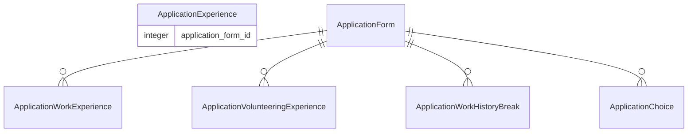
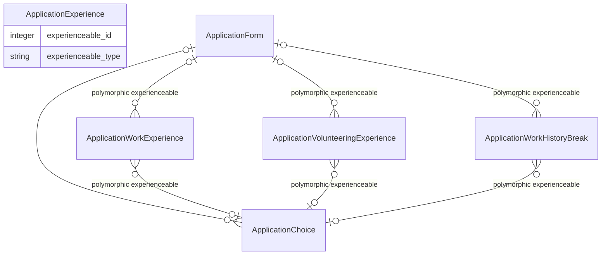

# 24. Enabling Work Experience changes

**Date:** 25/07/2024

## Status

Proposed

## Context

Currently after a Candidate has submitted an Application, they can no longer edit their Work Experience without help from the Support team and in many occasions a developer.

When Work Experience records are added, updated or removed after the Application has been submitted, the changes are visible to the Provider.
This causes problems when the Application has been actioned by a Provider.
e.g. If a Provider has rejected a Candidate due to a lack of Work Experience in schools, and the Candidate then adds Work Experience, through a support request, the Provider will now see that change on the rejected Application.

What we want to happen is that once an Application is submitted, there would be only a few reasons why it would be updated.

Updates to the Work Experience would not appear on any Applications that have been submitted.

### Technical

#### Data Model

The Work History section of the Candidate UI is powered by the following models.
Delivering an editable Work History feature will have to consider each of these models.

`ApplicationWorkExperience` and `ApplicationVolunteeringExperience` are both represented in the database by the `ApplicationExperience` record.

#### Vendor API

The Vendor API mainly revolves around the `ApplicationPresenter` for rendering the Application data.
This uses a mixture of `ApplicationForm` and `ApplicationChoice` attributes to render the Application data.

Work Experience is currently rendered from the `ApplicationForm`.

#### Enabling edits on the Application Form

There is a Support tool which can enable edits for a single Candidate, for a set amount of time. This can be enabled when a Candidate wants to make many changes to a submitted Application.

This tool applies many warning messages to the Candidate, to ensure they understand the implications of making changes to a submitted Application.

## Proposition

The long term objective of this change, and other that will follow, is to allow the Application Choice to become a snapshot of the Candidate's Application at the time of submission.

### 1. Duplicating records on submission

When a Candidate submits an Application, we will duplicate the Work Experience and Volunteering Experience records, connecting the new duplicates to the Application Choice.

This allows us to enable edits in the current Candidate interface, without affecting the Provider's view of the Application.

The Candidate will always be editing the `ApplicationForm`'s `WorkExperience` and `VolunteeringExperience` records. The Providers will always be viewing the `ApplicationChoice`'s `WorkExperience` and `VolunteeringExperience` records.

#### Changes

- Enable edits for the Work History section
- Change the `ApplicationExperience` to have a polymorphic association with `ApplicationChoice` or `ApplicationForm` rather than the current relation only to an `ApplicationForm`.
- Update the Provider UI and Vendor API to use the `ApplicationChoice` records for rendering the Work Experience, Volunteering Experience and Work History Breaks.
- Update the submitted application UI for a Candidate to use the `ApplicationChoice` records for rendering the Work Experience, Volunteering Experience and Work History Breaks.

##### Modelling

#### Pros

- Implementation is straightforward and can be done incrementally.
- The Candidate UI for editing Work Experience will be consistent with editing before submission.
- Data is clearly segregated when the Application is submitted.
- We don't have to consider the state of an Application at any point.
- Future changes made to the `ApplicationExperience` model will be consistent between `ApplicationForm` and `ApplicationChoice` records.

#### Cons

- Duplication of records will increase the size of the database.
- Candidates may be confused by the duplication of records.

### 2. Store snapshot data in JSON columns

The `ApplicationChoice` will have a JSON column for storing the snapshot of the Work Experience, Volunteering Experience and Work History Breaks at the time of submission.

This approach has been considered and rejected. The main reason for this is that the schema of the Work Experience and Volunteering Experience is not fixed and can change over time.
This would make it difficult to retrieve the data from the JSON column in future, as well as making migrations (changes to the Work Experience record) more complex.

### 3. Use audited to view snapshots

The `audited` gem can be used to view a snapshot of the Work Experience, Volunteering Experience and Work History Breaks at the time of submission.

This approach has been considered and rejected. The main reason for this is that the `audited` gem is not designed to be used in this way.
It is designed to track changes to records, not to store snapshots of records at a specific time.

