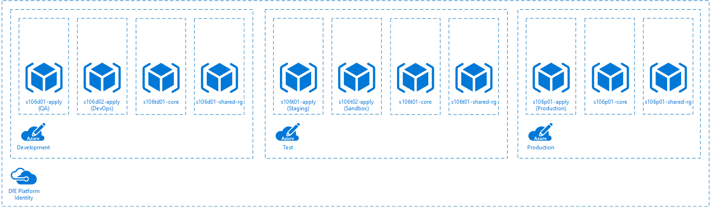
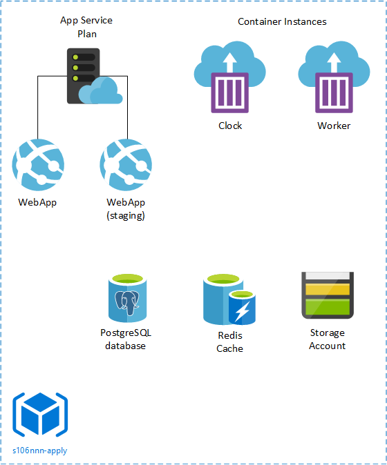

# Apply for Teacher Training - Azure Infrastructure 

## Purpose

This document describes the Azure architecture that the Apply for Teacher Training service is deployed into.

## Azure subscriptions

The apply service is deployed across three subscriptions located in the "DfE Platform Identity" tenant, otherwise known as the CIP tenant.

Within each subscription there are a number of resource groups. In Azure a resource group is simply a logical grouping of resources for ease of deployment, management and monitoring etc. The entire Apply service is contained in a single resource group with multiple instances of the application deployed across multiple resource groups as shown in the diagram above. All of these deployed instances are identical but wholly independent of each other. In addition to the two application instances there are some further resource groups that are required for other administrative reasons. These are:

- `s106nnn-core` - Provided by default in each subscription by the CIP team when creating the subscription and is used for connectivity back to the DfE corporate networks, for example. This is unused by Apply at the present time.
- `s106nnn-shared-rg` - This resource group exists in each subscription and contains the Key Vault that holds the SSL certificates for the public domains that are used on the application instances that have an education.gov.uk domain.

## Resource permissions

At the tenant level there are three user groups specifically created and linked to Apply's three subscriptions.

1. Reader - This is a read only group used to grant access to any user requiring access to view our subscriptions only.
1. Delivery Team - This is a group with contributor rights that grants the user read/write permissions on all resources in our subscriptions. Unlike the other groups the control of the permissions on this group varies across the three subscriptions and is controlled by Privileged Identity Management (PIM), which is covered below. This group is the default group for all Apply developers.
1. Managers - This is a read only group with permissions to approve PIM elevation requests.

Membership of these three groups can only be changed by members of the DevOps community, at the time of writing this includes Tom Pinney, Rizwan Khan and David Goodyear.

### Privileged Identity Manamgent (PIM)

The PIM mechanism gives users the ability to self-request an elevation in their permissions for a limited time with an audit trail of all requests. PIM only applies to the 'Delivery Team' group however its operation varies depending upon what subscription you're working in.
1. Development subscription - PIM not required, all users have contributor read/write permissions by default.
1. Test subscription - PIM requests required to obtain an elevation from reader to contributor rights. Self approval is immediate on this subscription.
1. Production subscription - PIM requests required to grant an elevation from reader to contributo rights. Approval required by a member of the 'Managers' user group.

Instructions on using PIM and be found in a separate guide here: [PIM Guide](pim-guide.md)

## Application resource group

The diagram below shows the core application dependent resources contained within each of the "-apply" resource groups shown in the earlier diagram. The performance of each resource and number of webapp container instances will vary across the resource groups depending upon the individual demands on their infrastructure, but the actual resource components present are identical.

All of the components should be self-explanatory to the developers with the exception of the storage account which is required for the storage of logs from the PostgreSQL database.

Not shown on the diagram are the Application Insights, Dashboard and availability monitor resources which are not required for the operation of the application but are critical to operational monitoring. The PostgreSQL database also has a firewall feature enabled to grant access only from the WebApp and container instances.

Each resrouce group also has a delete lock attached to it that prevents accidental deletion of the PostgreSQL database. This is required because although Azure provides backups of our database as part of the database resource, if you delete the resource accidentally Azure will also implicitly assume that the underlying backups are no longer required and delete these too.
