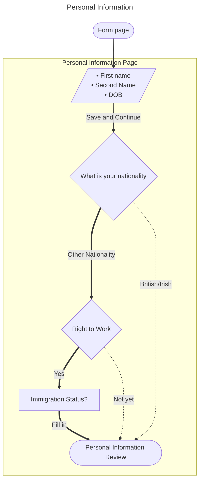

# Personal Information

```mermaid
---
title: Personal Information
---

flowchart TB
  start(["Form page"])
  pi-form[/"• First name\n• Second Name\n• DOB"/]
  nationality{"What is your nationality"}
  right-to-work{"Right to Work"}
  immigration-status["Immigration Status?"]
  review(["Personal Information Review"])

  start --> pi-form
  subgraph Personal Information Page
  pi-form -->|Save and Continue| nationality

  nationality ====>|Other Nationality| right-to-work
  right-to-work ==>|Yes| immigration-status
  immigration-status ==>|Fill in| review
  nationality -....->|British/Irish| review
  right-to-work -..->|Not yet| review
  end

```
