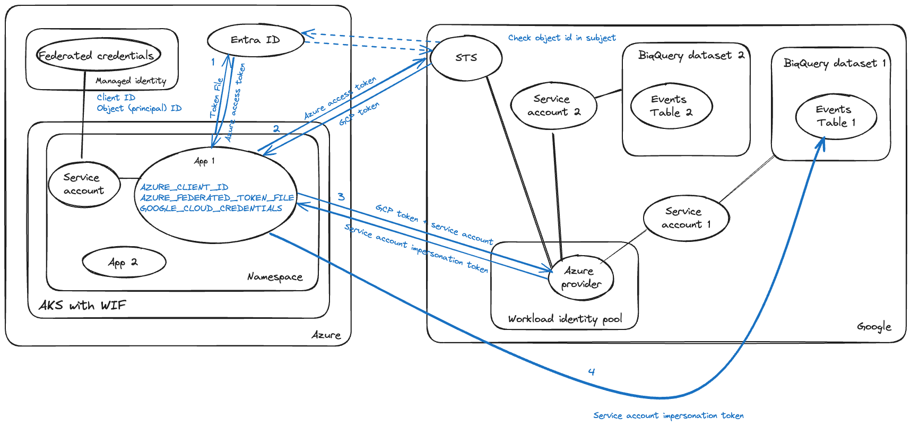

# Workload Identity Federation

When our applications needed to make authenticated requests to Google BigQuery we used JSON User Credentials which were stored in ENV vars.

DfE have moved away from JSON credentials and instead we use [Azure Workload Identity Federation (WIF)](https://learn.microsoft.com/en-us/entra/workload-id/workload-identity-federation) in order to harden security.

## How it works

We use a terraform variable [`enable_gcp_wif`](eafaea225f4e378a24984046c527d1f620d2ca1e) to set up specific pods with some keys. This is only enabled on the `worker` and `secondary-worker` pods.

This automatically sets two environment variables on the targetted pods which are used in the WIF process.

    ENV['AZURE_CLIENT_ID']
    ENV['AZURE_FEDERATED_TOKEN_FILE']

We also have a [Google Cloud Application Default Credentials (GCP credentials)](https://cloud.google.com/docs/authentication/application-default-credentials) file which is stored as an environment variable on the pods. `ENV['GOOGLE_CLOUD_CREDENTIALS_STATS']`.

### Steps

1. Get an Azure Access Token
    - Use `AZURE_CLIENT_ID` and `AZURE_FEDERATED_TOKEN_FILE` to get an access token from the URL specified in the Google Cloud Credentials.
2. Exchange the Azure Access Token for a GCP token
    - Use the Azure Access Token to get a GCP token from [Google Security Token Service API (STS)](https://cloud.google.com/iam/docs/reference/sts/rest).
3. Use the GCP token to get a Service Account Impersonation token (SAI token).
4. Use the SAI token to make authenticated requests to BigQuery.

The SAI token will expire in ~60 minutes. If the token is expired, a new token is requested.

#### WIF process diagram

## Google libraries

`Google::Cloud::Bigquery` vs `Google::Apis::BigqueryV2`

Previously, when using the Service Account JSON Credentials we were able to use the `Google::Cloud::BigQuery` library. This is a higher level "modern" libarary which manages smaller details of interacting with the service. This library does not support the OAuth authentication methods we now depend on and so we need to change the BigQuery client to use the Ruby Google API client for BigQuery V2 `Google::Apis::BigqueryV2`.

### Code

| Description | Module/Path                                                   |
| ---         | ---                                                           |
| Module      | `./../../lib/workload_identity_federation.rb`                 |
| Initializer | `./../../config/initializers/workload_identity_federation.rb` |
| Classes     | `WorkloadIdentityFederation::AzureAccessToken`                     |
|             | `WorkloadIdentityFederation::GoogleTokenExchange`             |
|             | `WorkloadIdentityFederation::GoogleAccessToken`               |
|             | `WorkloadIdentityFederation::UserCredentials`                 |

## Documentation

### Libraries
 - [RubyBigQuery#query_job](https://github.com/googleapis/google-api-ruby-client/blob/main/generated/google-apis-bigquery_v2/lib/google/apis/bigquery_v2/service.rb#L642)

 - [BigQueryV2 REST API jobs.query_job](https://cloud.google.com/bigquery/docs/reference/rest/v2/jobs/query)

 - [Ruby Google::Auth::UserRefreshCredentials](https://googleapis.dev/ruby/googleauth/latest/Google/Auth/UserRefreshCredentials.html)

### WIF

 - [Configure Workload Identity Federation with AWS or Azure](https://cloud.google.com/iam/docs/workload-identity-federation-with-other-clouds)
 - [What are managed identities for Azure resources?](https://learn.microsoft.com/en-us/entra/identity/managed-identities-azure-resources/overview)
 - [How Application Default Credentials works](https://cloud.google.com/docs/authentication/application-default-credentials)
 - [Security Token Service API](https://cloud.google.com/iam/docs/reference/sts/rest)
