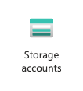
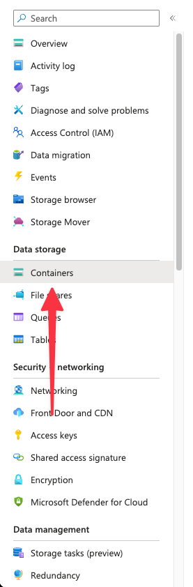
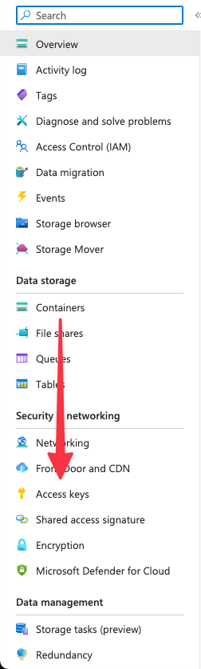
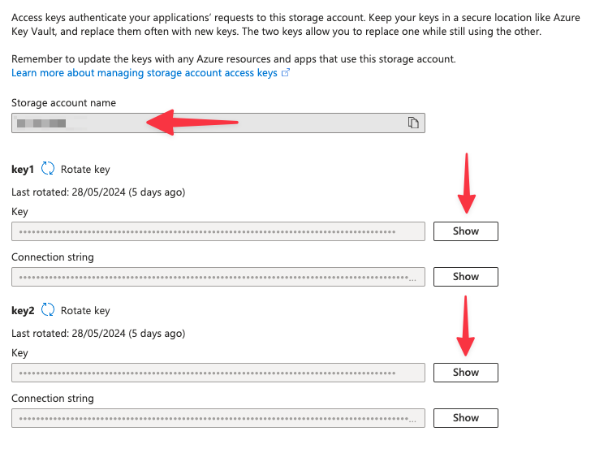

# Azure Storage

We use Azure Storage as our ActiveStorage backend for storing files, such as CSVs and images.

To learn more about Azure Storage, see the [Azure Storage documentation](https://docs.microsoft.com/en-us/azure/storage/).

## How to setup ActiveStorage with Azure Storage

To setup ActiveStorage with Azure Storage, you will need to add the following env vars:

```properties
AZURE_STORAGE_ACCOUNT_NAME=your_storage_account_name
AZURE_STORAGE_ACCESS_KEY=your_storage_account_key
AZURE_STORAGE_CONTAINER=your_container_name
```

## Navigating to Azure Storage in the Azure Portal

You can manage Azure Storage in the Azure Portal by navigating/searching for "Storage account".



Once you are in the Storage accounts menu, ensure a container is setup:



Once you have an account and container set up, you can now get an access key:



You can now "Show" and copy one of the access key and add it to your env vars.

Your storage account name will also be on this page.


