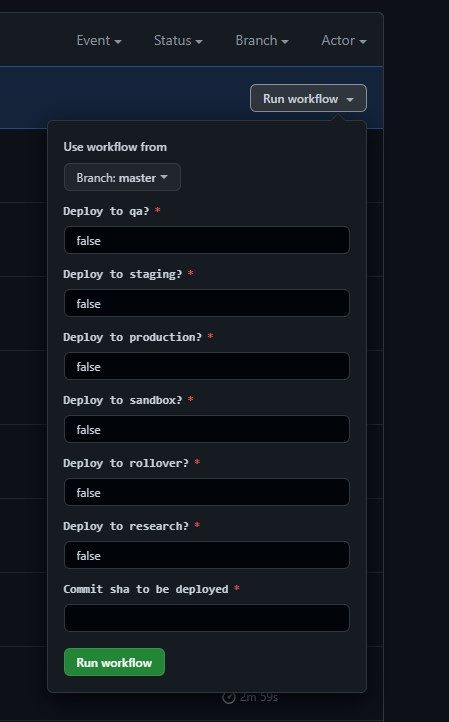

# How to: manually deploy Apply

This document describes the process of manually deploying a commit to a particular environment.

## When should this process be used?

In the event that code changes are made to the app but the pipelines fail to complete the deployment stages this process should be followed to deploy the commit manually.

These below instructions can also be used to rollback or to deploy an arbitary commit with an build image.

This process assumes that the build and test stage has completed without error and a Docker image has been uploaded to the GitHub container registry successfully.

## Instructions using GitHub Actions

1. Grab the commit sha to be used from either the [Apply ops dashboard](http://apply-ops-dashboard.azurewebsites.net) or the [build workflow](https://github.com/DFE-Digital/apply-for-teacher-training/actions/workflows/build.yml), in case of a rollback use the commit sha of the previous commit that needs to be deployed.

2. Go the deploy workflow and click on the "Run workflow" dropdown button, you'll see a list of apply environments like below.
  
3. Now paste the commit sha to be used in the "Commit sha to be deployed" textbox and `true` into the textboxes for the environments you want this commit to be deployed. Eg: if you want to deploy this commit only to `qa` enter `true` into the textbox below the "Deploy to qa?" label and leave the rest as `false`.
4. Click on the "Run workflow" button, this should trigger a run workflow run and deploy the commit sha to the selected environments.

## Instructions using make commands

**NOTE: Before following the steps below you will need to request an elevation of your rights to the 'contributor' role through PIM in the Azure Portal if working on an app hosted in the test or production subscriptions. Guidance on PIM can be found in the [PIM Guide](pim-guide.md) document. PIM is not required in the development subscription.**

Make commands can be run from the root of the repo to deploy a specific version to one of the environments.

1. Grab the commit sha to be used from either the [Apply ops dashboard](http://apply-ops-dashboard.azurewebsites.net) or the [build workflow](https://github.com/DFE-Digital/apply-for-teacher-training/actions/workflows/build.yml)

2. Copy a passcode for the cf cli from https://login.london.cloud.service.gov.uk/passcode
3. From the root of the repo you can run the below command to deploy the app.
  ```
  make <ENV> deploy tag=<COMMIT_SHA> passcode=<CF_SSO_CODE>
  eg: make qa deploy tag=4ebb7d13010839b1ab2b7ae0dfef57460a5101f3 passcode=XXXXXX
  ```
  This will list the changes about to be deployed and prompt for a confirmation, you can type "yes" to confirm and the changes will be applied.

  Environment | make command          | PIM required |
  ----------- | --------------------- | -----------  |
  qa          | make qa deploy        |  no
  research    | make research deploy  |  no
  load-test   | make load-test deploy |  no
  staging     | make staging deploy   |  yes (s121-findpostgraduateteachertraining-test)
  sandbox     | make sandbox deploy   |  yes (s121-findpostgraduateteachertraining-production)
  production  | make prod deploy      |  yes (s121-findpostgraduateteachertraining-production)
  rollover    | make rollover deploy  |  yes (s121-findpostgraduateteachertraining-test)

  You can also just preview the changes by running `deploy-plan` instead of `deploy` in the above command.

4. Check the `#twd_apply_tech` Slack channel for any runtime errors from
   Sentry or the smoke tests before proceeding to the next environment.
