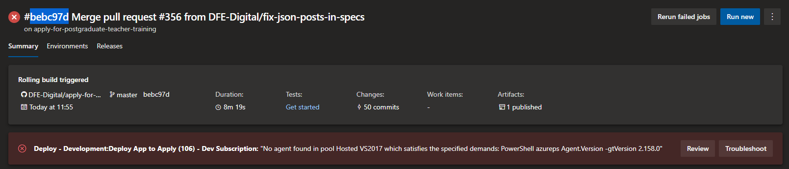
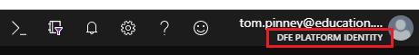
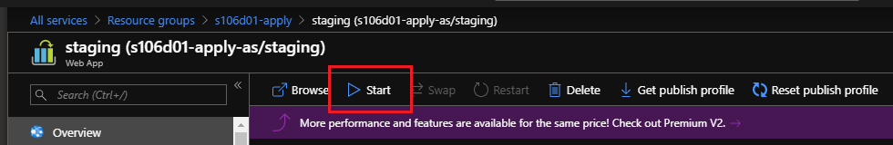
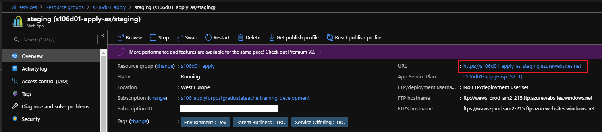
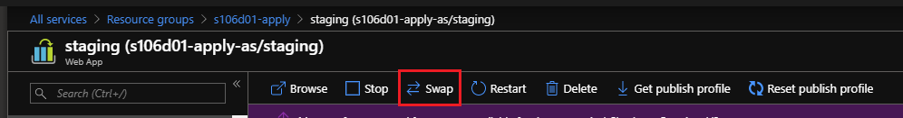
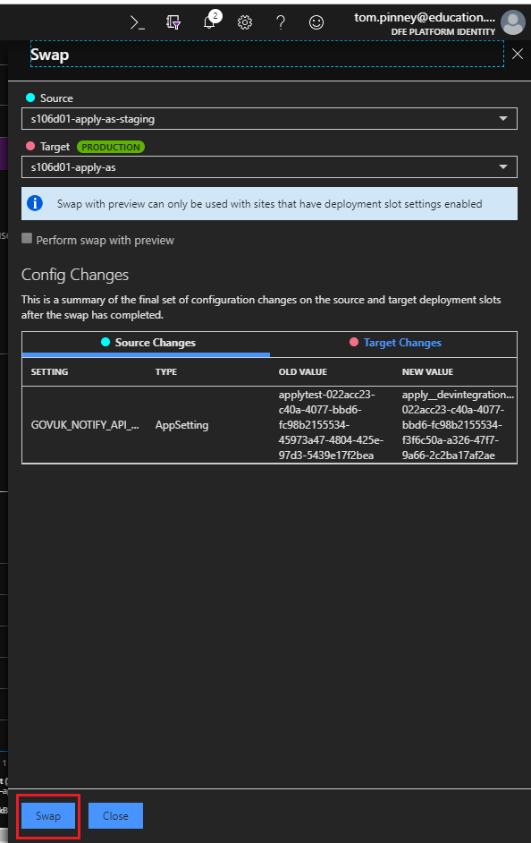
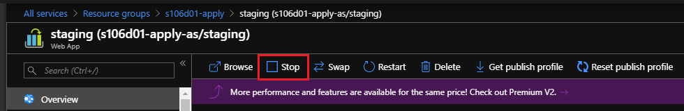

# Apply for Postgraduate Teacher Training - Manual Deployment

## Purpose

This document describes the process of manually deploying a new Docker image into the Azure app service.

### When should this process be used?

In the event that the Azure pipelines fail to complete the deployment stages this process should be followed to deploy the Docker image. This process assumes that the build and test stage has completed successfully and a Docker image have been uploaded to dockerhub.

## Instructions

1. Launch the Azure DevOps pages at https://dfe-ssp.visualstudio.com/Become-A-Teacher/_build?definitionId=49&_a=summary.
1. Locate the desired run from the list that has failed deployment and select it.
1. Copy the six character hex string at the start of the run name, without the leading '#', as shown in the following diagram, to the clipboard for use later.

1. Launch the Azure Portal at https://portal.azure.com and log in using your normal credentials.
1. Ensure that you are using the "DfE Platform Identity" directory, this is shown under your username at the top right of the GUI. To change directory click on your username at the top right, click on "Switch directory" and then select "DfE Platform Identity".

1. Select the "Resource groups" blade from the menu on the left
1. If the "Tags" column is not showing it is recommended that you click the "Edit columns" button and add it.
1. Select the resource group corresponding to the environment you wish to deploy the new Docker image into which will open a page showing all the resources associated with the environment.
1. Select the resource called "staging (s106xxx-apply-as/staging)" where xxx will be a combination of one letter and two numbers.

1. In the new menu that opens select "Container settings"
1. Locate the "Image and optional tag" field and delete the tag information after the colon, as indicated in the following diagram.

1. Paste in the new tag that you copied to the clipboard in step 3 and click the save button at the bottom of the page.
1. Once you have received acknowledgement that the changes have been saved, click on the "Overview" button in the menu for the staging container.
1. Click the "Start" button to launch the app in the staging container.

1. Click on the URL link in the block just below the start button. You must wait until the app start and the website begins to respond before continuing. This may take a couple of minutes and require you to refresh the page.

1. Once the website is responding you can click on the "Swap" button at the top of the page.

1. This will open the Swap configuration menu, no changes need to be made here, simply click the Swap button at the bottom of the menu. The menu will grey out while the swap process runs will take about 30 seconds to complete.

1. Click the "Close" button on the Swap menu
1. Open a new tab in your web browser and verify that the website updates have taken effect on the production slot.
1. Once you have confirmed that the changes have taken effect return the Azure portal window you previously had open and stop the app running in the staging slot. This now contains the image that was previous running in the production slot.

