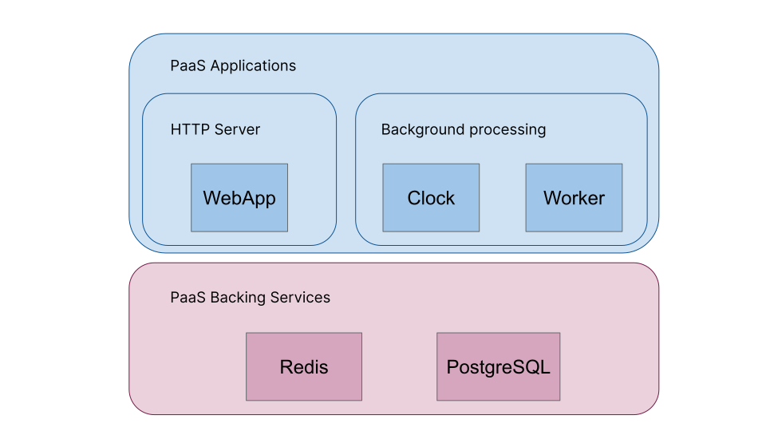

# PaaS Infrastructure 

## Purpose

This document describes the PaaS ([GOV.UK Platform as a Service](https://www.cloud.service.gov.uk)) architecture that the Apply for Teacher Training service is deployed into.

## PaaS spaces

The apply service is deployed across three PaaS 'spaces' that are shared with other services in BAT.

- `apply-prod` contains the *production* and *sandbox* Apply environment.
- `apply-staging` contains the *staging* Apply environment.
- `apply-qa` contains the *qa* Apply environment.

## Resource permissions

## Application resource group

The diagram below shows the core application dependent resources contained within each of the environments listed above. The resources allocated to each application will vary across the environments depending upon the individual demands on their infrastructure, but the actual components are identical.

