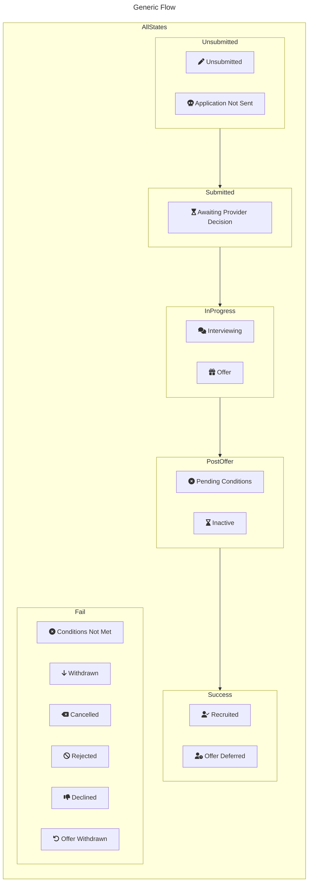

# State Flow Chart

```mermaid
---
title: Generic Flow
---
flowchart LR
subgraph AllStates
    subgraph Unsubmitted
        unsubmitted[fa:fa-pen Unsubmitted]
        application_not_sent[fa:fa-skull Application Not Sent]
    end

    subgraph Submitted
        awaiting_provider_decision[fa:fa-hourglass-start Awaiting Provider Decision]
    end

    subgraph "InProgress"
        interviewing[fa:fa-comments Interviewing]

        offer[fa:fa-gift Offer]
    end

    subgraph PostOffer
        pending_conditions[fa:fa-times-circle Pending Conditions]

        inactive[fa:fa-hourglass-end Inactive]
    end

    subgraph Success
        recruited[fa:fa-user-check Recruited]
        offer_deferred[fa:fa-user-clock Offer Deferred]
    end

    subgraph Fail
        conditions_not_met[fa:fa-times-circle Conditions Not Met]
        withdrawn[fa:fa-arrow-down Withdrawn]
        cancelled[fa:fa-backspace Cancelled]
        rejected[fa:fa-ban Rejected]
        declined[fa:fa-thumbs-down Declined]
        offer_withdrawn[fa:fa-undo Offer Withdrawn]
    end

    Unsubmitted ---> Submitted ---> InProgress ---> PostOffer ---> Success
end
```
