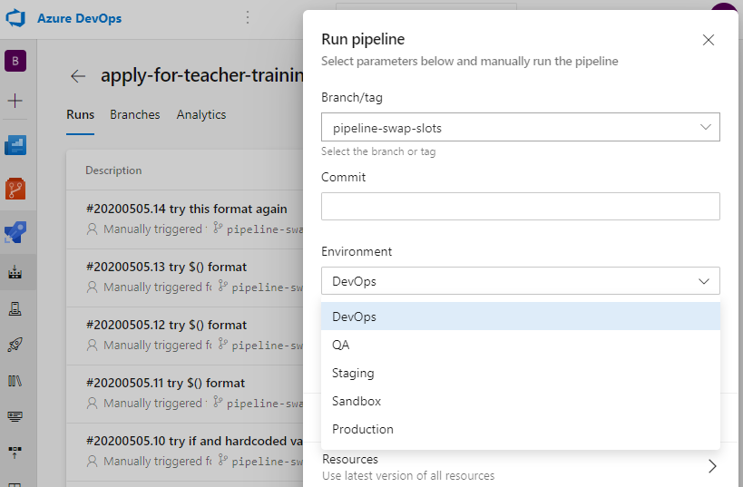

# How to: swap Azure App Service slots

In some cases where a particular deployment has to be rolled back,
we have to might be required to manually swap back the staging and production slot of the App service by logging on to the Azure Portal. This however requires an elevated permission and has to go through the PIM request approval workflow before being able to perform this task.

We can now perform this task on any environment by running the `apply-for-teacher-training-swap-slots` pipeline in Azure DevOps.

Select the correct environment from the pre configured drop down options, and Run the pipeline, the `staging` and `production` slots will be swapped once the pipeline run to completion.

