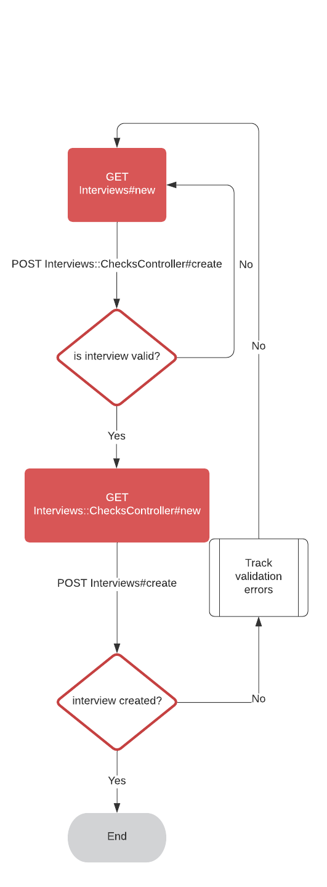
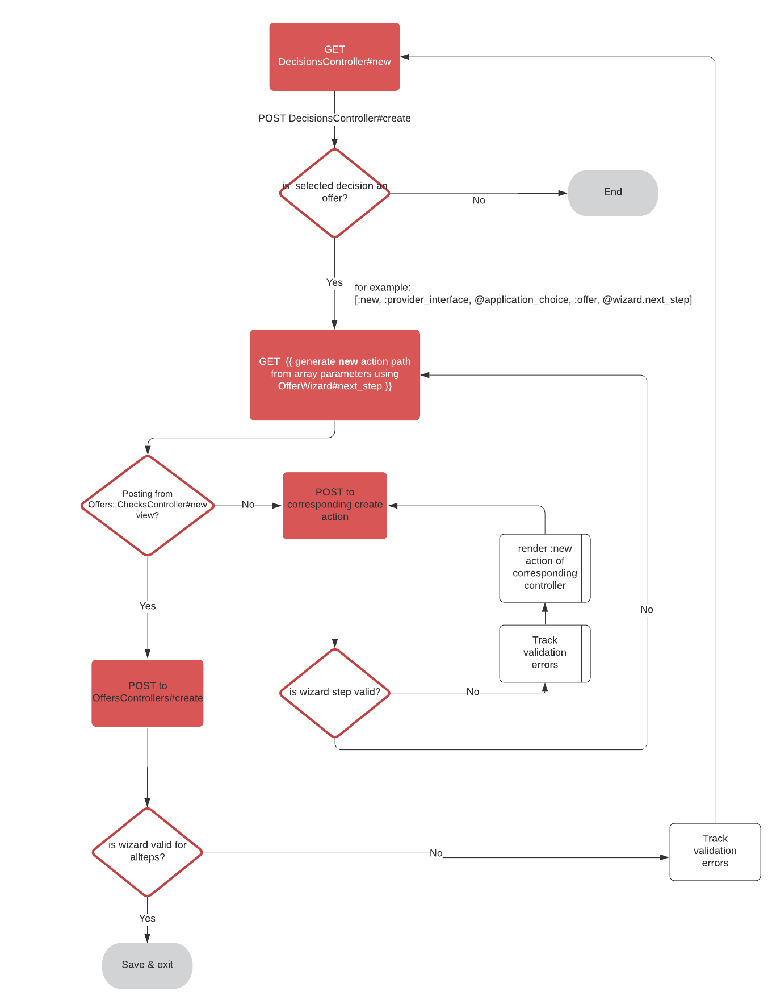

# Wizards

## Reusable modules

### 1. Base wizard (form model module)

```ruby
  include Wizard
```

Implements basic wizard functionality used by all wizarard implementations

### 2. Path history (form model module)

```ruby
  include Wizard::PathHelper
```

Enables storage of path details in order to enable correct navigation when using `back` button. This is achieved in combination with a helper that checks for the path based on the wizard's `previous_step`.

e.g. View helper `OfferPathHelper`

``` ruby

module OfferPathHelper
  def offer_path_for(application_choice, step, mode = :new, params = {})
    if step.to_sym == :select_option
      new_provider_interface_application_choice_decision_path(application_choice, params)
    elsif step.to_sym == :offer
      provider_interface_application_choice_offer_path(application_choice)
    else
      [mode, :provider_interface, application_choice, :offer, step, params]
    end
  end
end
```

#### Enabling back button support

#### Controller

To enable back button support you need to make sure to implement `action` in your base controller (in this instance InterviewsController), and to ensure that action is passed in to all instances of your wizard. You should only need to pass this in the `new` and/or `edit` actions and **not** when you `create` or `update`.

```ruby
    def action
      'back' if !!params[:back]
    end
```

```ruby
  @wizard = InterviewWizard.new(interview_store, interview_form_context_params.merge(current_step: 'input', action: action))
```

#### View

Ensure that the back button link also sets `back` to `true`. This enables the WizardPathHelper correctly identify the next and previous steps.

```ruby
<% content_for :before_content, govuk_back_link_to(interview_path_for(@application_choice, @wizard, nil, @wizard.previous_step, back: true)) %>
```


### 3. Clearing the wizard cache (controller module)


```ruby
    include ClearWizardCache
```

There are two ways to clear the wizard cache. The suggested configuration (a) is to setup the wizard flow controller and to explicitly exclude paths that the cache does not apply to (usually the index page). However, in some instances because of the structure of the wizard flow and not using CRUD that can be impossible to achieve so (b) is suggested.

a. Suggested configuration as it ensures that access to the wizard from outside the specified controllers will always clear the cache.

```ruby
def wizard_controller_excluded_paths
  [provider_interface_application_choice_interviews_path]
end

def wizard_flow_controllers
  ['provider_interface/interviews', 'provider_interface/interviews/checks'].freeze
end
```

b. Alternative, non optimal configuration as the wizard is only cleared when being accessed from specific entrypoints.

```ruby
def wizard_entrypoint_paths
  [new_provider_interface_application_choice_decision_path]
end
```

## Controller actions

For better separation of the code and all modules to be supported you should only be using CRUD rather than specifying custom actions.

So, for a creating a new set of data, e.g. an interview use `new` and `edit`, and for amending an existing interview, use `edit` and `update`. As most wizards contain a verification step, that should be achieved through navigating to a nested ChecksController (in this instance it would be `interviews/checks_controller`) . The flow should look something similar to the one below


### Simple flow


### Multi-step flow

