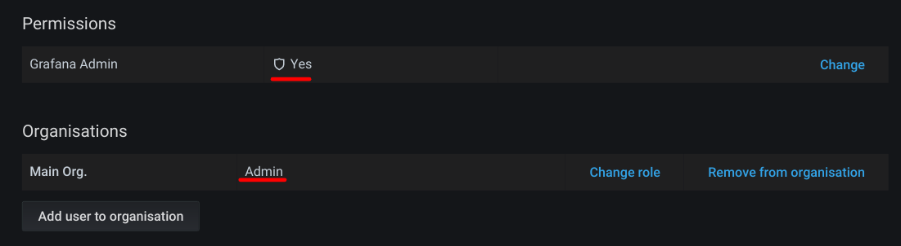
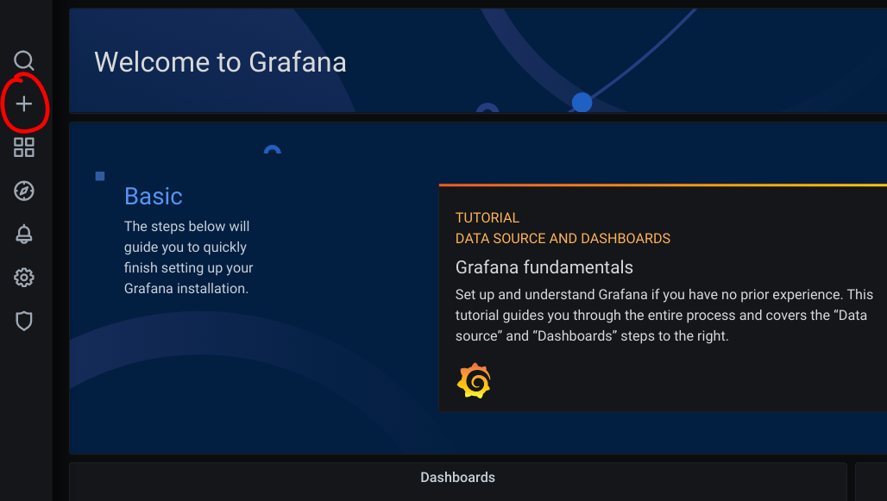
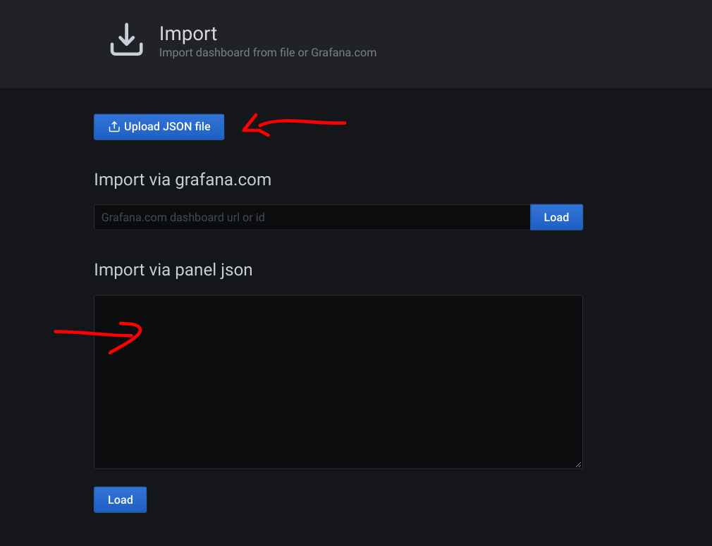

# How to restore Grafana load-testing dashboards

1. You need a user account with Admin privileges:

   

2. You can the use the '+' button on the left hand side to 'Import'

   

3. You can then provide a dashboard definition by uploading a JSON file or pasting the JSON contents into  the text area

   

JSON definitions of dashboards can be found within `jmeter/`, e.g. `loadtest-dashboard.json` and `michael-dashboard-1628694883356.json`
